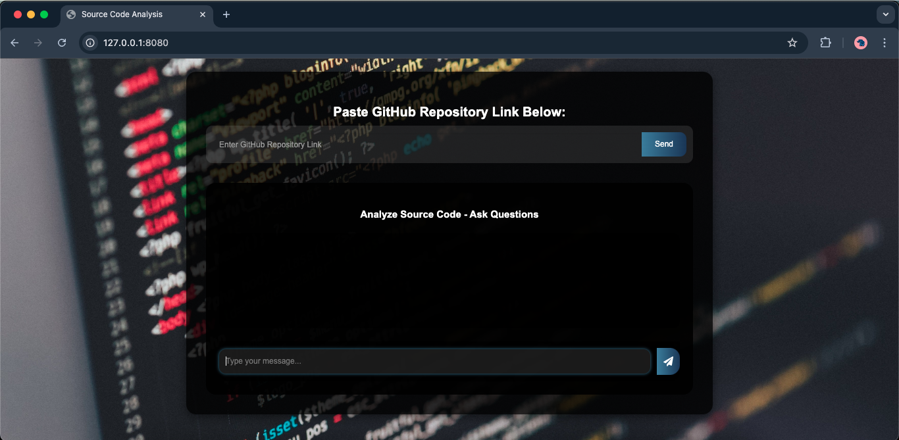

# 📘 Source Code Analysis ChatBot

**Developed by [Sabahat Atta](https://github.com/sabahatatta)**  

The **Source Code Analysis ChatBot** is an AI-driven conversational application that analyzes source code from GitHub repositories. It allows users to input a GitHub repository link, processes the repository, and answers questions about the functionality, structure, and dependencies of the source code in natural language.

---

## 🌟 Preview

Here’s how the application looks in action:



---

## 🚀 Features

- **Analyze GitHub Repositories**: Automatically clones and processes the repository provided by the user.
- **Natural Language Interaction**: Ask questions like "What does this function do?" or "Explain the code structure."
- **Automatic Code Chunking**: Breaks down the codebase into manageable chunks for better processing.
- **Memory for Conversations**: Maintains context throughout the chat using memory-based LLM chains.
- **Error Handling**: Gracefully handles invalid inputs or repository errors.

---

## 📂 Folder Structure

```plaintext
├── db/                    # Persisted embeddings database (ChromaDB)
├── repo/                  # Cloned GitHub repository for analysis
├── research/              # (Optional) Research-related code
├── src/                   # Source code for backend logic
│   ├── helper.py          # Core functions for repository ingestion, splitting, and embedding
├── static/                # Static assets like images, stylesheets
│   ├── chat_icons/        # Icons for the chat UI
├── templates/             # HTML templates for frontend
│   ├── index.html         # Main frontend interface
├── .env                   # Environment variables
├── app.py                 # Flask application backend
├── requirements.txt       # Python dependencies
├── setup.py               # Setup for additional tasks
├── store_index.py         # Script to persist embeddings into ChromaDB
└── README.md              # Project documentation
```

---

## ⚙️ Tools and Technologies Used

### Frontend:
- **HTML5, CSS3**: For building the user interface.
- **Bootstrap**: Responsive and elegant design framework.
- **JavaScript & jQuery**: Enabling dynamic content and AJAX calls.

### Backend:
- **Flask**: Lightweight web framework for Python.
- **LangChain**: AI toolchain for managing chains and memory.
- **ChromaDB**: Vector database for efficient embeddings storage and retrieval.
- **OpenAI GPT-3.5**: Language model for answering code-related queries.

### Other Tools:
- **GitPython**: To clone and manage GitHub repositories.
- **dotenv**: For secure management of environment variables.

---

## 🛠️ How It Works

1. **Repository Link Input**: Users enter a GitHub repository URL into the app.
2. **Repository Processing**:
   - The backend clones the repository into a `repo/` directory.
   - The repository is processed using LangChain to extract Python files and split them into manageable chunks.
3. **Embeddings Creation**:
   - The code chunks are embedded using OpenAI's embeddings API and stored in a ChromaDB vector store.
4. **Question-Answering**:
   - Users can ask questions about the repository.
   - The backend uses a **ConversationalRetrievalChain** to retrieve relevant code chunks and answer queries.
5. **Chat Interface**:
   - The frontend dynamically displays user messages and bot responses.

---

## 🔄 Code Flow

1. **User Interaction**:
   - User enters a GitHub repository link.
   - The app processes the repository, displaying a success or error message.
   - Users can then ask questions about the code.

2. **Backend Logic**:
   - `helper.py`: Handles cloning repositories, loading documents, splitting them, and creating embeddings.
   - `store_index.py`: Generates and persists the embeddings in ChromaDB.
   - `app.py`: Flask app managing routes (`/chatbot` for repository ingestion, `/get` for question-answering).

3. **Frontend**:
   - `index.html`: Displays the input field and chat interface.
   - JavaScript handles AJAX calls and updates the chat UI.

---

## 📈 Future Enhancements

- **Support for More Languages**: Extend support to JavaScript, Java, and more.
- **UI Improvements**: Add advanced styling and animations for a better user experience.
- **File Upload**: Allow users to upload files instead of providing GitHub links.
- **Code Summarization**: Generate concise summaries for entire repositories or files.
- **Authentication**: Secure the app with user authentication and role-based access.
- **API Integration**: Create an API for external tools to interact with the ChatBot.

---

## 📋 Requirements

1. **Python 3.8 or above**
2. Install dependencies:
   ```bash
   pip install -r requirements.txt
   ```

---

## 🔧 Setup and Installation

1. Clone the repository:
   ```bash
   git clone https://github.com/sabahatatta/Source-Code-Analysis-ChatBot.git
   cd Source-Code-Analysis-ChatBot
   ```

2. Set up your OpenAI API key:
   - Create a `.env` file:
     ```
     OPENAI_API_KEY=your_openai_api_key_here
     ```

3. Run the embedding storage script:
   ```bash
   python store_index.py
   ```

4. Start the application:
   ```bash
   python app.py
   ```

5. Open in your browser:
   ```
   http://127.0.0.1:8080
   ```

---

## 🖼️ Additional Screenshot (Optional)

If you'd like to showcase different states of the app (e.g., with a question and response), you can add another screenshot like:


---

## 🤝 Contributing

Feel free to fork the repository and make contributions. Open a pull request with detailed descriptions of the changes you’ve made.

---

## 📜 License

This project is open-source and available under the [MIT License](LICENSE).

---

Enjoy using the Source Code Analysis ChatBot and feel free to reach out with any suggestions or contributions! 🚀